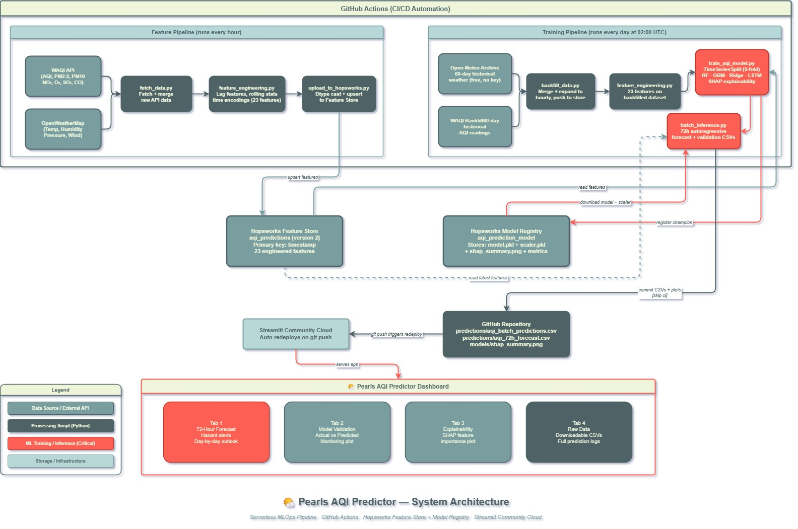

# 🌤️ Pearls AQI Predictor
### A Production-Grade, Serverless MLOps Pipeline for 72-Hour Air Quality Forecasting

**Live Dashboard →** [pearls-aqi-predictor.streamlit.app](https://rawalpindi-aqi-forecast.streamlit.app)  
**Author →** [Aleeza Rizwan](https://linkedin.com/in/aleeza-rizwan/) · Data Science Intern, 10 Pearls SHINE Cohort 2026

---

> Predict the Air Quality Index (AQI) for Rawalpindi, Pakistan, 72 hours into the future, using a fully automated, serverless MLOps stack. No manual intervention required after deployment: data flows in hourly, models retrain daily, and the dashboard updates automatically.

---

## 📋 Table of Contents

- [Project Overview](#-project-overview)
- [Live Demo](#-live-demo)
- [System Architecture](#-system-architecture)
- [Pipeline Components](#-pipeline-components)
  - [Feature Pipeline](#1-feature-pipeline)
  - [Backfill Pipeline](#2-backfill-pipeline)
  - [Training Pipeline](#3-training-pipeline)
  - [Batch Inference & Web App](#4-batch-inference--web-app)
- [Feature Engineering](#-feature-engineering)
- [Machine Learning Models](#-machine-learning-models)
- [Model Performance](#-model-performance)
- [Explainability : SHAP](#-explainability--shap)
- [CI/CD Automation](#-cicd-automation)
- [Tech Stack](#-tech-stack)
- [Repository Structure](#-repository-structure)
- [Getting Started](#-getting-started)
- [Data Sources](#-data-sources)
- [Dashboard Features](#-dashboard-features)
- [Key Design Decisions](#-key-design-decisions)
- [Limitations & Future Work](#-limitations--future-work)
- [Acknowledgements](#-acknowledgements)

---

## 🧠 Project Overview

Air quality in Rawalpindi, Pakistan is a significant public health concern. The city regularly records AQI levels in the "Unhealthy" to "Hazardous" range, particularly during winter months. This project builds a complete, production-grade MLOps system that:

1. **Automatically fetches** real-time weather and pollutant data every hour from WAQI and OpenWeatherMap APIs
2. **Engineers a rich feature set** including lag features, rolling statistics, and time-based encodings
3. **Stores features in a cloud Feature Store** (Hopsworks) for reproducibility and auditability
4. **Trains and compares multiple ML models** daily, automatically selecting the champion
5. **Registers the champion model** in a cloud Model Registry with full metrics tracking
6. **Generates 72-hour forward forecasts** using an autoregressive inference loop
7. **Serves predictions** through a styled, interactive Streamlit dashboard with hazard alerts

The entire pipeline runs without human intervention on GitHub Actions; a true serverless MLOps architecture.

---

## 🚀 Live Demo

**Dashboard URL:** [pearls-aqi-predictor.streamlit.app](https://rawalpindi-aqi-forecast.streamlit.app)

The live app shows:
- Real-time 72-hour AQI forecast for Rawalpindi with hazard-level alerts
- Day-by-day breakdown (Day 1 / Day 2 / Day 3) with AQI category labels
- Historical actual vs. predicted AQI (model validation view)
- SHAP feature importance plot from the latest trained model
- Downloadable forecast and validation CSVs

The dashboard auto-updates every time the daily training pipeline runs and commits fresh predictions to the repository.

---

## 🏗️ System Architecture



---

## 🔧 Pipeline Components

### 1. Feature Pipeline

**Script:** `fetch_data.py` → `feature_engineering.py` → `upload_to_hopsworks.py`  
**Trigger:** Every hour via GitHub Actions cron (`0 * * * *`)

The feature pipeline is the heartbeat of the system. Each hourly run:

- Calls the **WAQI API** (geo-coordinates: 33.5973°N, 73.0479°E) to fetch current AQI, PM2.5, PM10, NO₂, O₃, SO₂, and CO readings
- Calls the **OpenWeatherMap API** to fetch temperature, humidity, atmospheric pressure, and wind speed
- Appends the new row to `aqi_history.csv`
- Runs `feature_engineering.py` to compute all derived features
- Upserts the engineered row into the **Hopsworks Feature Group** (`aqi_predictions`, version 2)

The pipeline includes robust error handling: if either API times out or returns an error, the run logs a warning and exits gracefully rather than crashing the workflow.

---

### 2. Backfill Pipeline

**Script:** `backfill_data.py`  
**Trigger:** Manually or at the start of the daily training run

Because the system is new, historical data must be backfilled before the first meaningful model can be trained. The backfill pipeline:

- Fetches **60 days** of historical AQI data from the WAQI history endpoint (or falls back to the `forecast.daily` field if the history endpoint is rate-limited)
- Fetches **60 days** of hourly weather data from the **Open-Meteo Historical Archive API** (free, no key required, covers years of history)
- Merges both sources on timestamp
- Expands daily AQI readings into hourly rows (since WAQI provides daily granularity historically, while Open-Meteo provides hourly weather)
- Engineers all features on the expanded dataset
- Casts all columns to correct dtypes (`float64` for continuous, `int64` for categoricals) to satisfy the Hopsworks schema validator
- Pushes the full backfilled dataset to the Feature Store

---

### 3. Training Pipeline

**Script:** `train_aqi_model.py`  
**Trigger:** Every day at 02:00 UTC via GitHub Actions cron (`0 2 * * *`)

The training pipeline implements a rigorous model selection process:

**Data Loading:** Attempts to read from the Hopsworks Feature Store. Falls back to the locally generated `aqi_features.csv` if the offline store is still materializing (a known Hopsworks behavior on the free tier where Hudi file materialization can lag by minutes).

**Preprocessing:**
- Sorts chronologically (critical for time-series integrity)
- Drops rows only on core columns (`aqi`) to preserve rows even if pollutant sensors return null
- Fills all-null columns (e.g. PM10/NO₂ when WAQI fallback is used) with `0`
- Fills remaining NaNs with column medians
- Final `fillna(0)` catches any column whose median is itself NaN

**Model Evaluation:** Uses **TimeSeriesSplit(n_splits=5)** critically, not random train-test split. Random splitting causes data leakage in time-series because future values end up in the training set. TimeSeriesSplit always trains on the past and evaluates on the future.

**Champion Selection:** The model with the lowest average RMSE across all 5 folds is selected as champion.

**Final Training:** The champion is retrained on the full dataset using a final `StandardScaler` fit on all available data.

**Registry:** The champion model, scaler, and SHAP plot are saved to `models/` and uploaded to the Hopsworks Model Registry with full metrics (RMSE, MAE, R²).

---

### 4. Batch Inference & Web App

**Scripts:** `batch_inference.py` → `app.py`  
**Trigger:** Runs after training in the daily GitHub Actions workflow

The batch inference script:

1. Downloads the latest champion model and scaler from the Hopsworks Model Registry (always fetches the highest version number dynamically)
2. Reads the latest features from the Feature Store (CSV fallback if materializing)
3. Generates **historical validation predictions** : actual vs. predicted on the full feature history
4. Generates a **72-hour autoregressive forward forecast** using a sliding `window_history` buffer:
   - Seeds the buffer with the last 24 actual AQI values
   - At each step, computes rolling statistics and lag features from the live buffer
   - Predicts the next hour's AQI
   - Appends the prediction back into the buffer so subsequent steps use it as context
   - Repeats for all 72 hours
5. Saves `predictions/aqi_batch_predictions.csv` and `predictions/aqi_72h_forecast.csv`
6. Generates a monitoring plot
7. Commits all output files back to the repository (`[skip ci]` tag prevents infinite loops)

The Streamlit dashboard (`app.py`) then reads these CSVs directly. Because the training pipeline commits them, Streamlit Community Cloud auto-redeploys on every push.

---

## ⚙️ Feature Engineering

`feature_engineering.py` computes the following features from raw API data:

| Feature | Type | Description |
|---|---|---|
| `hour` | Time-based | Hour of day (0–23) |
| `day_of_week` | Time-based | Day of week (0=Monday, 6=Sunday) |
| `month` | Time-based | Month of year (1–12) |
| `is_weekend` | Time-based | Binary flag for Saturday/Sunday |
| `aqi_diff` | Change rate | First-order difference of AQI (captures momentum) |
| `aqi_lag_1` | Lag feature | AQI at t-1 hour |
| `aqi_lag_2` | Lag feature | AQI at t-2 hours |
| `aqi_lag_3` | Lag feature | AQI at t-3 hours |
| `aqi_lag_24` | Lag feature | AQI at t-24 hours (same time yesterday) |
| `aqi_rolling_6h_mean` | Rolling stat | 6-hour rolling mean of AQI |
| `aqi_rolling_24h_mean` | Rolling stat | 24-hour rolling mean of AQI |
| `aqi_rolling_6h_std` | Rolling stat | 6-hour rolling standard deviation |
| `aqi_rolling_24h_std` | Rolling stat | 24-hour rolling standard deviation |
| `temp` | Weather | Temperature in °C |
| `humidity` | Weather | Relative humidity (%) |
| `pressure` | Weather | Atmospheric pressure (hPa) |
| `wind_speed` | Weather | Wind speed (m/s) |
| `pm25` | Pollutant | PM2.5 concentration (µg/m³) |
| `pm10` | Pollutant | PM10 concentration (µg/m³) |
| `no2` | Pollutant | Nitrogen dioxide (ppb) |
| `o3` | Pollutant | Ozone (ppb) |
| `so2` | Pollutant | Sulphur dioxide (ppb) |
| `co` | Pollutant | Carbon monoxide (ppm) |

**Why lag features matter:** Air quality has strong temporal autocorrelation; if AQI has been rising for 3 hours, it's likely to keep rising. Without lag features, the model has no memory of recent conditions and is forced to predict from static features alone. The 24-hour lag captures the same-time-yesterday effect, which is powerful for seasonal/diurnal patterns.

**Why rolling statistics matter:** Rolling means smooth out noise and capture the sustained trend, while rolling standard deviations capture volatility; a sudden spike in AQI std suggests an anomalous pollution event.

---

## 🤖 Machine Learning Models

Three classical ML models are trained and compared on every daily run:

### Random Forest Regressor
```python
RandomForestRegressor(n_estimators=200, random_state=42, n_jobs=-1)
```
An ensemble of 200 decision trees trained on random feature subsets. Robust to outliers and non-linear relationships. Naturally handles the interaction between lag features and weather variables. Supports native SHAP TreeExplainer for interpretability.

### Gradient Boosting Regressor
```python
GradientBoostingRegressor(n_estimators=200, random_state=42)
```
Sequential ensemble where each tree corrects the residuals of the previous. Often achieves lower bias than Random Forest at the cost of higher variance. Also supports SHAP TreeExplainer.

### Ridge Regression
```python
Ridge(alpha=1.0)
```
L2-regularized linear regression. Acts as a strong baseline and often performs surprisingly well on time-series data when features are well-engineered. Fast to train and interpret. Uses permutation importance when SHAP TreeExplainer is not applicable.

### LSTM (optional)
A deep learning model using two stacked LSTM layers with dropout regularization, trained on sliding windows of 24 hours. Skipped gracefully if TensorFlow is not installed in the environment.

```python
Sequential([
    LSTM(64, input_shape=(24, n_features), return_sequences=True),
    Dropout(0.2),
    LSTM(32),
    Dropout(0.2),
    Dense(1)
])
```

**Champion selection:** The model with the lowest average RMSE across 5 TimeSeriesSplit folds is registered as the champion. All metrics (RMSE, MAE, R²) are stored in the Hopsworks Model Registry alongside the model artifact.

---

## 📊 Model Performance

Performance on the current dataset (216 hourly rows from WAQI backfill + hourly accumulation):

| Model | RMSE | MAE | R² |
|---|---|---|---|
| Random Forest | 20.12 | 14.02 | -0.14 |
| Gradient Boosting | 21.97 | 15.73 | -0.15 |
| **Ridge Regression ← Champion** | **12.90** | **7.60** | **-0.13** |

> **Note on negative R²:** R² is negative when the model performs worse than simply predicting the mean. This is expected at low data volumes, with only ~70 usable rows after cleaning (lag features produce NaN for the first 24 rows), each TimeSeriesSplit fold has only ~11 training samples. R² will converge to positive territory as the hourly pipeline accumulates data over days and weeks. RMSE and MAE are the more meaningful metrics at this stage and show Ridge Regression's advantage; its linear inductive bias generalises better than tree ensembles on small datasets.

---

## 🔍 Explainability (SHAP)

SHAP (SHapley Additive exPlanations) is used to explain model predictions. For tree-based champion models (Random Forest, Gradient Boosting), `shap.TreeExplainer` is used, an exact, model-native method that is computationally efficient. For Ridge Regression, permutation importance is used as a fallback.

The SHAP summary plot shows:
- **Feature importance** (features ranked by mean |SHAP value|)
- **Feature effect direction** (red = pushes AQI prediction higher, blue = pushes lower)
- **Value distribution** (spread of SHAP values shows consistency of effect)

Expected top features based on domain knowledge:
- `aqi_lag_1`, `aqi_lag_24` — recent AQI is the strongest predictor of near-future AQI
- `aqi_rolling_24h_mean` — sustained pollution levels persist
- `hour`, `is_weekend` — diurnal and weekly traffic/industrial patterns
- `wind_speed` — higher wind disperses pollutants, reducing AQI
- `humidity` — high humidity traps particulate matter, increasing AQI

The SHAP plot is saved to `models/shap_summary.png` and displayed in the **Explainability** tab of the dashboard.

---

## ⚡ CI/CD Automation

Two GitHub Actions workflows automate the entire pipeline:

### Feature Pipeline (Hourly)

**File:** `.github/workflows/feature_pipeline.yml`  
**Schedule:** `0 * * * *` (every hour on the hour)

```
Steps:
1. Checkout repository
2. Set up Python 3.11
3. Install dependencies (requirements.txt + hopsworks==4.7.* + confluent-kafka)
4. python fetch_data.py                    → fetches AQI + weather
5. python feature_engineering.py           → computes all features
6. python upload_to_hopsworks.py           → upserts to Feature Store
```

### Training Pipeline (Daily)

**File:** `.github/workflows/training_pipeline.yml`  
**Schedule:** `0 2 * * *` (2:00 AM UTC = 7:00 AM PKT)

```
Steps:
1. Checkout repository
2. Set up Python 3.11
3. Install dependencies
4. python backfill_data.py                  → 60 days of historical data
5. python feature_engineering.py            → engineer features on backfill
6. python train_aqi_model.py                → train + evaluate + register champion
7. python batch_inference.py                → generate 72h forecast + validation CSVs
8. git add predictions/*.csv models/*.png
9. git commit -m "Automated sync [skip ci]"
10. git push origin main                    → triggers Streamlit Cloud redeploy
```

Both workflows use **GitHub Secrets** for API key injection (`WAQI_TOKEN`, `OWM_KEY`, `HOPSWORKS_API_KEY`), no credentials are ever hardcoded or committed.

---

## 🛠️ Tech Stack

| Layer | Tool | Purpose |
|---|---|---|
| **Data Ingestion** | WAQI API | Real-time AQI + pollutant readings |
| **Data Ingestion** | OpenWeatherMap API | Real-time weather data |
| **Data Ingestion** | Open-Meteo Archive API | Free historical weather (no key) |
| **Feature Store** | Hopsworks (free tier) | Versioned feature storage + retrieval |
| **Model Registry** | Hopsworks Model Registry | Model versioning + metrics tracking |
| **ML Framework** | scikit-learn | Random Forest, Gradient Boosting, Ridge |
| **Deep Learning** | TensorFlow/Keras | LSTM model (optional) |
| **Explainability** | SHAP | Feature importance + TreeExplainer |
| **CI/CD** | GitHub Actions | Hourly + daily pipeline automation |
| **Dashboard** | Streamlit | Interactive web app |
| **Hosting** | Streamlit Community Cloud | Free, auto-redeploys on git push |
| **Data processing** | pandas, numpy | Feature engineering + data manipulation |
| **Visualization** | matplotlib, seaborn | Monitoring plots + EDA |
| **Secrets** | GitHub Secrets + python-dotenv | Secure credential management |

---

## 📁 Repository Structure

```
Pearls-AQI-Predictor/
│
├── .github/
│   └── workflows/
│       ├── feature_pipeline.yml      # Hourly CI: fetch → engineer → upload
│       └── training_pipeline.yml     # Daily CI: backfill → train → forecast → deploy
│
├── .streamlit/
│   └── config.toml                   # Theme: teal/slate/coral palette, serif font
│
├── predictions/
│   ├── aqi_batch_predictions.csv     # Historical actual vs predicted (auto-updated)
│   ├── aqi_72h_forecast.csv          # 72-hour forward forecast (auto-updated)
│   └── aqi_inference_plot.png        # Monitoring plot (auto-updated)
│
├── models/
│   └── shap_summary.png              # SHAP feature importance plot (auto-updated)
│
├── app.py                            # Streamlit dashboard (4 tabs)
├── fetch_data.py                     # Hourly API fetcher (WAQI + OWM)
├── feature_engineering.py            # Feature computation (lag, rolling, time)
├── upload_to_hopsworks.py            # Feature Store upserter
├── backfill_data.py                  # Historical data backfill (60 days)
├── train_aqi_model.py                # Multi-model training + SHAP + registry
├── batch_inference.py                # 72h autoregressive forecast generator
├── download_model.py                 # Utility: pull model from registry locally
├── test_api.py                       # Utility: verify all 4 API connections
├── AQI_Analysis.py                   # EDA: 8 analysis plots
├── run_hourly.py                     # Legacy: local hourly loop (replaced by Actions)
├── requirements.txt                  # Python dependencies
├── .env.example                      # Template for local secrets
└── .gitignore                        # Excludes .env, venvs, pkl files, CSVs
```

---

## 🚀 Getting Started

### Prerequisites

- Python 3.11
- A Hopsworks account (free at [hopsworks.ai](https://hopsworks.ai))
- A WAQI token (free at [aqicn.org/api](https://aqicn.org/api))
- An OpenWeatherMap key (free at [openweathermap.org/api](https://openweathermap.org/api))

### Local Setup

```bash
# 1. Clone the repository
git clone https://github.com/its-aleezA/Pearls-AQI-Predictor.git
cd Pearls-AQI-Predictor

# 2. Create and activate virtual environment
python -m venv .venv
source .venv/bin/activate      # Linux/Mac
.venv\Scripts\activate         # Windows

# 3. Install dependencies
pip install -r requirements.txt
pip install "hopsworks==4.7.*" confluent-kafka

# 4. Set up environment variables
cp .env.example .env
# Edit .env and add your API keys:
# WAQI_TOKEN=your_token
# OWM_KEY=your_key
# HOPSWORKS_API_KEY=your_key

# 5. Test API connections
python test_api.py

# 6. Run the backfill to populate the Feature Store
python backfill_data.py

# 7. Train the first model
python train_aqi_model.py

# 8. Generate forecasts
python batch_inference.py

# 9. Launch the dashboard
streamlit run app.py
```

---

## 📡 Data Sources

| Source | Data | Endpoint | Key Required |
|---|---|---|---|
| WAQI | AQI, PM2.5, PM10, NO₂, O₃, SO₂, CO | `api.waqi.info/feed/geo:{lat};{lon}/` | Yes (free) |
| OpenWeatherMap | Temperature, humidity, pressure, wind | `api.openweathermap.org/data/2.5/weather` | Yes (free) |
| Open-Meteo | Historical weather (60+ days) | `archive-api.open-meteo.com/v1/archive` | No |
| WAQI Forecast | Historical AQI backfill (fallback) | `api.waqi.info/feed/{city}/` | Yes (free) |

All APIs used are free tier. The system is designed to degrade gracefully; if WAQI is unavailable, the run is skipped and logged; if OWM fails, weather columns are set to `None` and filled later with medians.

---

## 📈 Dashboard Features

The Streamlit dashboard is organized into 4 tabs:

### Tab 1 : 72-Hour Forecast
- **Hazard alert banner**: color-coded by severity (WHO thresholds: 100 / 150 / 200 / 300)
- **4 metric cards**: Next 1h AQI, 24h Peak, 72h Peak, 72h Average
- **Time-series forecast chart**: full 72-hour timeline
- **Day-by-day summary**: Day 1 / Day 2 / Day 3 with avg, peak, and category label

### Tab 2 : Model Validation
- **3 metric cards**: Latest Actual AQI, Latest Predicted AQI, Prediction Error
- **Historical line chart**: actual vs predicted (last 100 records)
- **Monitoring plot**: side-by-side validation and forecast view

### Tab 3 : Explainability
- **SHAP summary plot**: feature importance from the champion model
- Explanatory text on how to read the plot

### Tab 4 : Raw Data
- **Validation prediction log**: full dataframe of historical predictions
- **72-hour forecast table**: complete forecast with hours-ahead column
- **Download buttons**: export both CSVs directly from the browser

The dashboard uses a custom colour palette (`#B8D8D8` light blue / `#7A9E9F` cool steel / `#4F6367` blue slate / `#EEF5DB` beige / `#FE5F55` coral) with Playfair Display (serif) for headings and DM Sans for body text. A dynamically coloured SVG city skyline in the header shifts from teal-blue (clean air) to warm ochre and dark red as the forecasted AQI rises.

---

## 💡 Key Design Decisions

**TimeSeriesSplit over random split:** Standard `train_test_split` with `shuffle=True` leaks future data into the training set for time-series tasks. `TimeSeriesSplit` strictly respects temporal ordering; the model always trains on the past and evaluates on the future.

**Fallback chain for data access:** Rather than crashing when Hopsworks' offline store hasn't finished materializing (a ~5 minute lag on the free tier), every script has a graceful fallback to local CSVs. This makes the pipeline resilient to infrastructure delays without human intervention.

**`window_history` sliding buffer in inference:** Naively using the last known feature row for all 72 forecast steps would freeze rolling statistics and lag features at their last observed values, producing increasingly inaccurate predictions. The sliding buffer updates rolling stats and lag values at every step using previous predictions as context; mathematically equivalent to how the features were computed during training.

**`[skip ci]` on automated commits:** The training pipeline commits updated prediction CSVs back to `main`. Without `[skip ci]`, this commit would trigger the training pipeline again, creating an infinite loop. The tag instructs GitHub Actions to ignore the commit for workflow triggering.

**No model binaries in git:** `.pkl` and `.keras` files are excluded from version control via `.gitignore`. Models live in the Hopsworks Model Registry; the only source of truth for trained artifacts. This keeps the repository lightweight and avoids binary diff noise.

---

## 🔮 Limitations & Future Work

### Current Limitations

- **Data volume:** The free WAQI tier provides limited historical depth. 60-day backfill via the forecast endpoint gives only daily granularity (expanded to hourly by replication). Genuine hourly historical data would dramatically improve model quality.
- **Weather forecast integration:** The 72-hour forward forecast currently carries forward the last known weather values. Integrating a weather forecast API (e.g. Open-Meteo Forecast) would provide actual future temperature/wind/humidity inputs, improving forecast accuracy.
- **Model complexity:** Ridge Regression is currently the champion due to limited data. With more data, Gradient Boosting or LSTM will likely outperform it. The pipeline automatically promotes the best model as data accumulates.
- **Single location:** Currently hardcoded to Rawalpindi (33.5973°N, 73.0479°E). A multi-city extension would require parameterizing the location inputs.

### Future Work

1. **Multi-city support** — extend to Lahore, Karachi, and Islamabad with a city selector in the dashboard
2. **Weather forecast API integration** — feed actual forecast weather into the 72-hour prediction window
3. **Alert notifications** — email or SMS alerts when hazardous AQI is predicted (Twilio / SendGrid)
4. **Model monitoring** — track prediction drift over time; trigger automatic retraining if RMSE degrades
5. **Subhourly granularity** — integrate a sensor network for 15-minute resolution data
6. **AQI subtype breakdown** — separate PM2.5, NO₂, and O₃ sub-indices rather than predicting composite AQI only

---

## 🙏 Acknowledgements

This project was built as part of an Data Science internship at **10 Pearls**.

---

## 👤 Author

[**Aleeza Rizwan**](https://github.com/its-aleezA) · LinkedIn: [aleeza-rizwan](https://linkedin.com/in/aleeza-rizwan/)

---

## 📄 License

This project is open source and available under the MIT License.

---

> *"Build systems that run themselves."*
